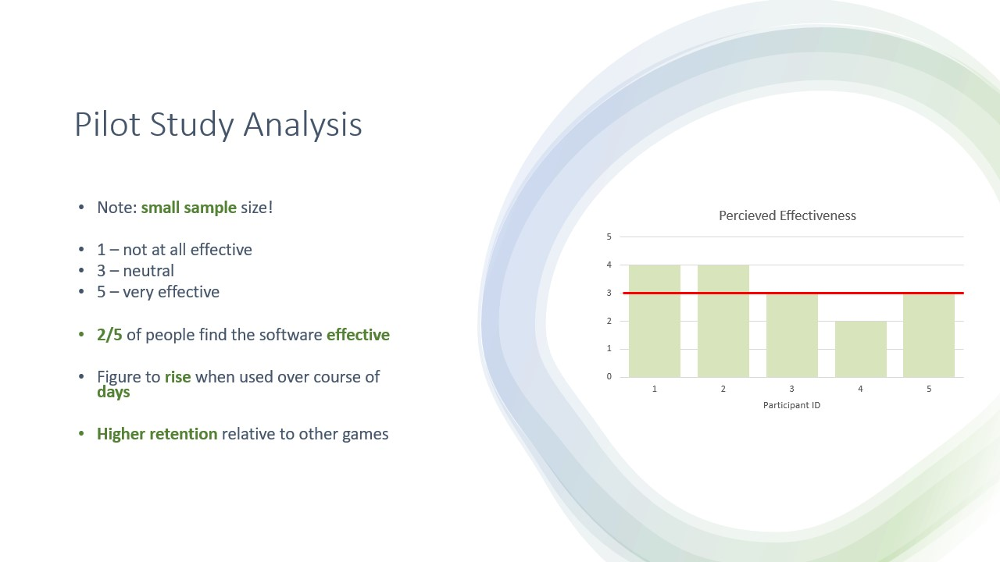
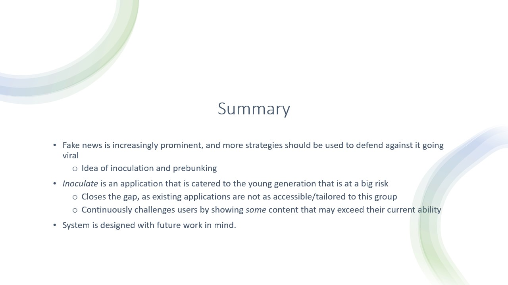
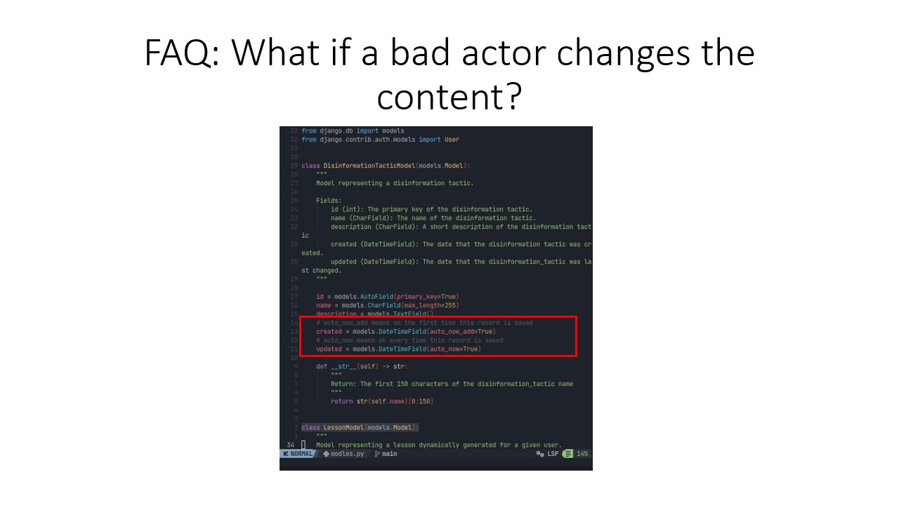

# inoculate

This Git repository contains code for a mobile-friendly, fake news inoculation application 'inoculate'. The project was developed as part of a final year project at University of Nottingham in 2023-2024.

## Getting Started

1. Clone this repo.

2. Configure and install dependencies: read the manuals in the section below. These will guide you through configuration processes to get the software running smoothly on your system. 

3. Start the app!

## Manuals

* [inoculate/README.md](./inoculate/README.md) - the manual for the 'inoculate' (the frontend).
* [prebunk/README.md](./prebunk/README.md) - the manual for the 'inoculate' (the frontend).

## Abstract

Fake news inoculation games exist and have proven to be effective, but these are often designed for the
web. This dissertation argues that it is critical to target the mobile sphere, as young teens increasingly use
mobile phones more than laptops/desktops. Additionally, fake news continues to be a problem on social
media networks – which are beginning to replace traditional media for news dissemination.

The dissertation covers the implementation of a Fake News Inoculation Game, designed for mobile phones.
The backend is robust and available, as it hosted on a virtual private server.

A pilot study has been performed. The results suggest that a greater study could be done to see the
performance of the application on both a wider audience. Also more critically, such a study would circumvent
some limitations of the current system, such as how the current content available is quite simple when the
difficulty is low. A more effective study might want users to progress to higher difficulties that align more
closely to the real world.

The application attempts to gamify the inoculation experience by adjusting difficulty to tailor an indi-
vidual experience to the user.

## Files

* Publications (e.g. Final and Interim Report) - [Publications OneDrive Link](https://uniofnottm-my.sharepoint.com/personal/psysk9_nottingham_ac_uk/_layouts/15/onedrive.aspx?id=%2Fpersonal%2Fpsysk9%5Fnottingham%5Fac%5Fuk%2FDocuments%2FFake%20News%20Inoculation%20Game%2F5%2E%20Publications%20%28Public%29&view=0) (you might need to email to get access to the drive).
* Developer Manuals:
    * [Frontend - `inoculate`](./inoculate/README.md)
    * [Backend - `prebunk`](./prebunk/README.md)

## Presentation

|       |
| ----- |
|  |
|  |
|  |
|  |
|  |
|  |
|  |
|  |
|  |
|  |
|  |
|  |
|  |
|  |
|  |
|  |
|  |
|  |
|  |
|  |
|  |

